# 💰 Expense Tracker

A modern, feature-rich expense tracking application built with Flutter and Firebase. Track your spending, manage categories, and gain insights into your financial habits with beautiful visualizations.


---

## 📱 Features

- ✅ **User Authentication** - Secure sign-in/sign-up with Firebase Auth
- 💸 **Expense Management** - Add, edit, and delete expenses with detailed information
- 🏷️ **Custom Categories** - Create and manage personalized expense categories with emoji icons
- 📊 **Visual Reports** - Interactive pie and bar charts for spending analysis
- 📅 **Date Range Selection** - View expenses by month and year
- 💳 **Payment Methods** - Track expenses by payment type (cash, credit, debit, etc.)
- 🔄 **Real-time Sync** - Cloud-based storage with instant updates
- 🌍 **Multi-currency Support** - Pick currencies and view converted totals
- 📱 **Portrait Mode Lock** - Optimized for handheld use with locked portrait orientation
- ↔️ **Swipe Navigation** - Seamlessly swipe between tabs (Home, Expenses, Reports, Budgets)
- 🧮 **Default Currency** - Set a baseline currency for reports and totals
- 📸 **Receipt Photo Uploads** - Attach receipt images to expenses
- 🧾 **Receipt Scanning (OCR)** - Scan receipts to auto-fill fields (supports auto-crop and perspective correction)
- 📤 **Export Data** - Generate CSV and PDF expense reports
- 🌙 **Dark Mode** - Toggle light and dark themes
- 🎨 **Theme Customization** - Pick an accent color for the app
- 🔁 **Recurring Expenses** - Automate monthly or yearly entries
- 🧭 **Tab Navigation** - Quick access across Home, Expenses, Reports, Budgets
- 🫧 **Empty States** - Helpful placeholders when there is no data yet
- 🔁 **Report Conversion** - View reports converted to your default currency
- 🧾 **Expense Scope Filter** - Browse expenses by month in the Expenses tab
- 👤 **Profile & Settings Hub** - Central place for settings, logout, and account deletion
- ✉️ **Account Emails** - Welcome and deletion emails via Firebase Cloud Functions
- ↩️ **Undo Deletion** - Restore accidentally deleted expenses with a single tap

---

## 🎬 Demo & Screenshots

### 1. User Authentication

Sign in to your account or create a new one to get started.

<div align="center">
  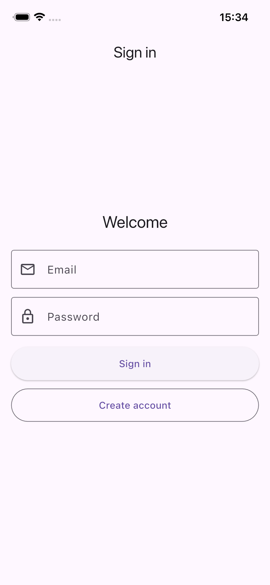
</div>

**Creating an Account:**

<div align="center">
  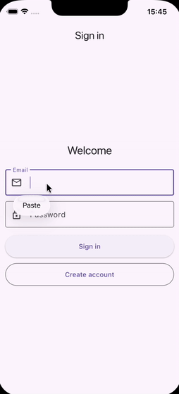
</div>

---

### 2. Home Dashboard

View your monthly spending summary and recent transactions at a glance.

<div align="center">
  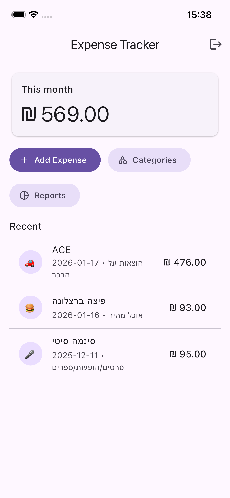
</div>

**Features:**
- 📈 Monthly spending total
- 📝 Recent transactions list
- 🎯 Quick access to all features
- 🔓 Logout option

---

### 3. Tab Navigation
    
Switch between the app's core areas with a streamlined bottom bar or by swiping left and right.

<div align="center">
  
</div>

**Features:**
- 👆 Tap tabs to navigate
- ↔️ Swipe between tabs for fluid navigation
- 🔄 State preservation (scroll position kept when switching tabs)


---

### 4. Currency Picker

Choose the currency for each expense and totals.

<div align="center">
  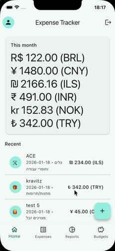
</div>

---

### 5. Default Currency

Set the baseline currency used in summaries and reports.

<div align="center">
  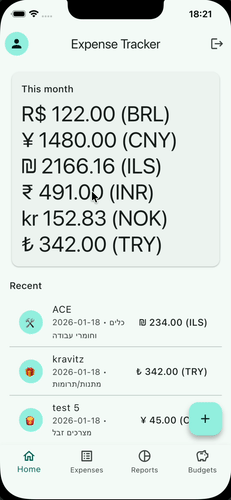
</div>

---

### 6. Empty State Placeholders

Friendly guidance when there are no expenses yet.

<div align="center">
  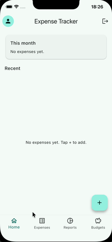
</div>

---

### 7. Adding Expenses

Easily add new expenses with comprehensive details.

<div align="center">
  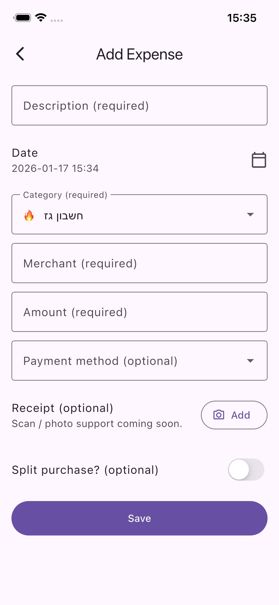
</div>

**Adding an Expense:**

<div align="center">
  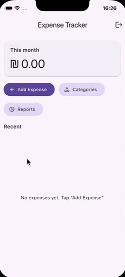
</div>

**Expense Details Include:**
- 📝 Description
- 💵 Amount (in ₪)
- 🏪 Merchant name
- 📅 Date & time
- 🏷️ Category selection
- 💳 Payment method
- ✂️ Split purchase option

---

### 8. Managing Expenses

Edit or delete existing expenses with ease.

<div align="center">
  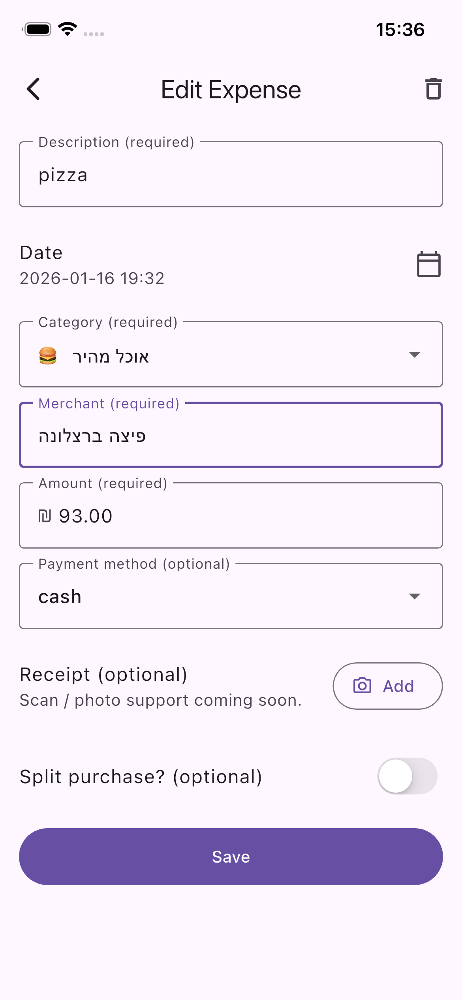
</div>

**Editing and Managing Expenses:**

<div align="center">
  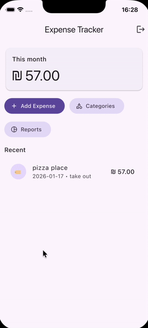
</div>

**Management Features:**
- ✏️ Edit any transaction detail
- 🗑️ Delete with confirmation
- 📊 View transaction history

---

### 9. Slide to Delete & Undo

Swipe left on any expense to reveal a delete button. You can partial swipe to reveal the button or full swipe to delete.
- 🛑 **Confirmation**: A dialog confirms your intent to delete.
- ↩️ **Undo**: Accidentally deleted? Use the "Undo" action in the snackbar to restore it immediately.
- 🧹 **Clean UX**: If you cancel deletion, the row resets automatically.

<div align="center">
  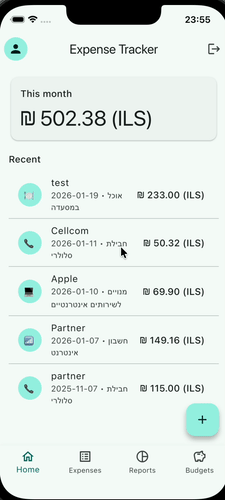
</div>

---

### 10. Category Management

Create and customize your own expense categories.

<div align="center">
  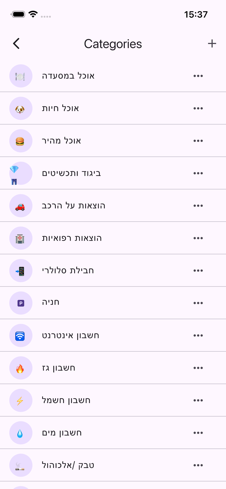
</div>

**Creating a Category:**

<div align="center">
  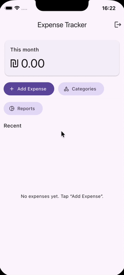
</div>

**Category Features:**
- ➕ Add custom categories
- 😊 Emoji icon support
- ✏️ Edit category names and icons
- 🗑️ Delete categories (transactions preserved)
- 🎨 Color-coded in reports

---

### 11. Reports & Analytics

Gain insights into your spending patterns with interactive charts.

<div align="center">
  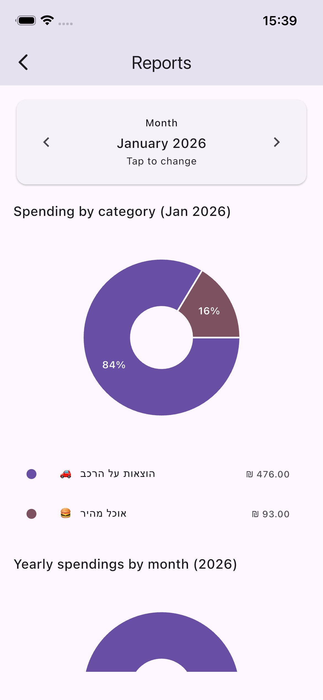
</div>

**Viewing Reports:**

<div align="center">
  
</div>

**Report Types:**
- 🥧 **Category Pie Chart** - Monthly spending breakdown by category
- 📊 **Monthly Bar Chart** - Yearly spending comparison by month
- 📈 **Trend Analysis** - Identify spending patterns
- 🗓️ **Date Range Selection** - View historical data

---

### 12. Report Currency Conversion

View analytics with converted totals in your default currency.

<div align="center">
  
</div>

---

### 13. Receipt Photo Uploads

Attach receipt images to keep proof of purchase with each expense.

<div align="center">
  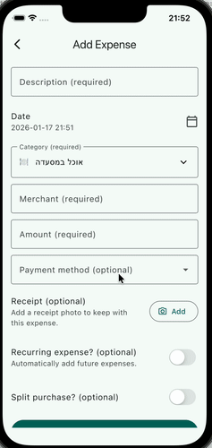
</div>

---

### 14. Receipt Scanning (OCR)

Scan receipts and auto-fill key fields before saving. Now features advanced document scanning with:
- 📷 Auto-detection of document edges
- ✂️ Auto-crop and perspective correction
- 🔍 Cleaner text recognition for better accuracy

<div align="center">
  
</div>

---

### 15. Export Data

Generate CSV or PDF reports for sharing and archiving.

<div align="center">
  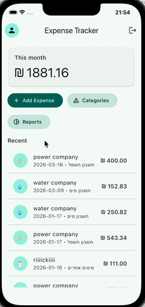
</div>

---

### 16. Dark Mode

Switch between light and dark themes from settings.

<div align="center">
  
</div>

---

### 17. Recurring Expenses

Automatically add monthly or yearly expenses.

<div align="center">
  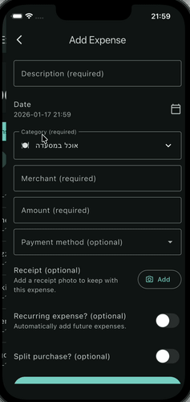
</div>

---

## 🚀 Getting Started

### Prerequisites

- Flutter SDK (3.10.7 or higher)
- Firebase account
- iOS Simulator / Android Emulator or physical device

### Installation

1. **Clone the repository**
   ```bash
   git clone https://github.com/yourusername/expense_tracker.git
   cd expense_tracker
   ```

2. **Install dependencies**
   ```bash
   flutter pub get
   ```

3. **Configure Firebase**
   - Create a new Firebase project at [Firebase Console](https://console.firebase.google.com/)
   - Enable Authentication (Email/Password)
   - Enable Cloud Firestore
   - Download and add configuration files:
     - `google-services.json` → `android/app/`
     - `GoogleService-Info.plist` → `ios/Runner/`

4. **Run the app**
   ```bash
   flutter run
   ```

---

## 📖 How to Use

### First Time Setup

1. **Create an Account**
   - Launch the app
   - Tap "Create account"
   - Enter your email and password
   - You'll be automatically logged in

2. **Set Up Categories**
   - Default categories are created automatically
   - Add custom categories via the "Categories" button
   - Use emojis to make them visually distinctive

### Daily Usage

1. **Adding an Expense**
   - Tap "Add Expense" on the home page
   - Fill in the required fields (Description, Amount, Merchant)
   - Select a category
   - Optionally add payment method and other details
   - Tap "Save"

2. **Viewing Expenses**
   - Recent expenses appear on the home page
   - Tap any expense to view or edit details
   - Monthly total is displayed at the top

3. **Analyzing Spending**
   - Tap "Reports" to view analytics
   - Use the month/year picker to view different periods
   - See spending breakdown by category (pie chart)
   - Compare monthly spending over the year (bar chart)

4. **Managing Categories**
   - Tap "Categories" to view all categories
   - Tap the menu icon (⋮) on any category to edit or delete
   - Add new categories as needed

---

## 🏗️ Architecture

### Tech Stack

- **Frontend:** Flutter (Dart)
- **Backend:** Firebase
  - Firebase Authentication
  - Cloud Firestore
  - Cloud Functions (transactional emails)
- **Charts:** fl_chart
- **State Management:** StatefulWidget with StreamBuilder

### Project Structure

```
lib/
├── main.dart                    # App entry point
├── auth_gate.dart              # Authentication routing
├── models/                     # Data models
│   ├── category_model.dart
│   └── transaction_model.dart
├── pages/                      # App screens
│   ├── login_page.dart
│   ├── home_page.dart
│   ├── edit_transaction_page.dart
│   ├── categories_page.dart
│   └── reports_page.dart
├── services/                   # Business logic
│   └── firestore_service.dart
├── widgets/                    # Reusable components
│   ├── transaction_tile.dart
│   ├── category_picker.dart
│   └── date_range_picker.dart
└── charts/                     # Chart components
    ├── monthly_bar.dart
    └── spending_pie.dart
```

---

## 🎨 Design Features

- **Material Design 3** - Modern, clean UI
- **Adaptive Components** - Platform-specific widgets
- **Color Palette System** - Consistent theming
- **Emoji Support** - Visual category identification
- **Responsive Layout** - Works on all screen sizes
- **Dark Mode Ready** - Theme-aware components

---

## 💡 Key Features Explained

### Payment Methods

Track how you pay for expenses:
- 💵 Cash
- 💳 Credit
- 🏦 Debit
- 📱 BIT Transfer
- 🍎 Apple Pay
- 🔀 Other

### Split Purchase

Mark expenses that are shared or split with others for better tracking.

### Real-time Updates

All data syncs instantly across devices using Firebase Firestore streams.

### Category Colors

Each category is automatically assigned a color for easy visualization in charts.

---

## 🔮 Upcoming Features

- 🔔 Budget alerts and notifications
- 👥 Shared expenses with other users
- 🌍 Multi-currency support expansion
- 📈 More detailed analytics and trends

---

## 🤝 Contributing

Contributions are welcome! Please feel free to submit a Pull Request.

1. Fork the project
2. Create your feature branch (`git checkout -b feature/AmazingFeature`)
3. Commit your changes (`git commit -m 'Add some AmazingFeature'`)
4. Push to the branch (`git push origin feature/AmazingFeature`)
5. Open a Pull Request

---

## 📄 License

This project is licensed under the MIT License - see the [LICENSE](LICENSE) file for details.

---

## 👨‍💻 Developer

Built with ❤️ using Flutter

---

## 🙏 Acknowledgments

- [Flutter](https://flutter.dev/) - The amazing UI toolkit
- [Firebase](https://firebase.google.com/) - Backend infrastructure
- [fl_chart](https://pub.dev/packages/fl_chart) - Beautiful charts library
- [Material Design](https://m3.material.io/) - Design system

---

## 📞 Support

For issues, questions, or suggestions, please open an issue on GitHub.

---

<div align="center">
  Made with Flutter 💙
</div>
